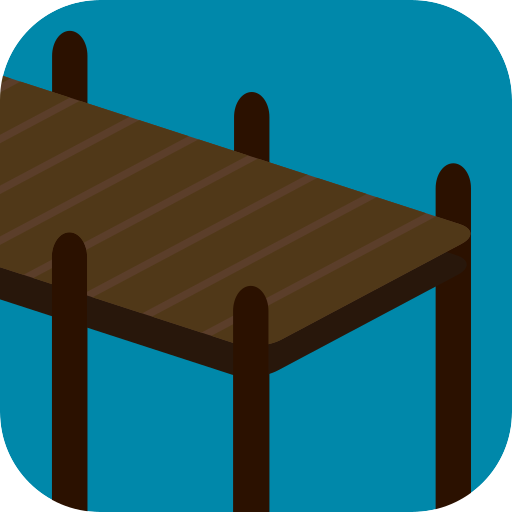
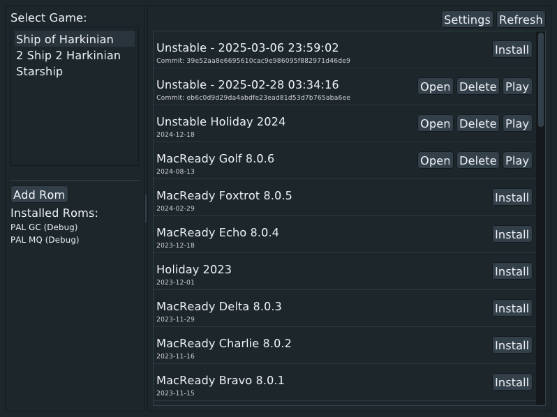

#  Marina - Game Launcher

## Description

Marina is an **unofficial** launcher & version manager for the PC ports made by Harbour Masters.

<!---->

## Features

- Supported Games:
  - Ship of Harkinian
  - 2 Ship 2 Harkinian
  - Starship
- Quick access to downloads for all major versions
  - Access to latest development build
- Basic ROM Validation & Management

## Limitations

### Rom Validation

Currently the supported rom hashes are hard-coded into the program. Any newly supported roms by Harbour Masters will require a new release here.

Additionally, Marina doesn't validate whether a rom is valid for the particular version you play. If you try to use a ROM that is not supported on an older version, Marina will still attempt to launch the game with the unsupported ROM.

### GitHub API

Marina fetches the version lists using the public GitHub api. The API is rate limited by IP address, so you run the chance of being temporarily banned. To mitigate this risk, Marina only fetches new versions once every 1hr on launch.

You can manually refresh using the button in the top right, but if you refresh too often you will likely hit the rate limit and be blocked.

### Mismatched release asset names

Marina identifies os-compatible downloads via the label on releases assets. (ex: "SoH-<Version>-Win64.zip"). Some releases (typically older ones) don't follow this naming scheme, so Marina won't be able to download them.

## Testing

If I was a good developer there would be tests.

## Support

I created Marina both as a pet project to try out golang, and also as a proof of concept for what a version-manager & launcher would look like for these projects. There will surely be many bugs. I will try to fix anything major and within my ability, but I don't plan to maintain this project indefinitely. Don't expect major breakages to be resolved with any urgency.

> [!CAUTION]
> This alpha software and part of its feature-set includes deleting files. Be VERY careful when modifying the install location. [See Here](#testing)
